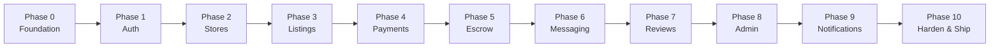

# U-Shop MVP Build Plan — Production-Grade, Feature by Feature

> **Methodology:** Vertical Slice Architecture — each feature is built end-to-end (Schema → API → Frontend → Tests) before moving to the next. This ensures a shippable product at every milestone.

> **Timeline:** 12 weeks (as per PRD v2.0)

---

## Build Order Strategy



> [!IMPORTANT]
> Each phase builds on the previous. Do NOT skip ahead. A broken foundation will haunt every feature built on top of it.

---

## Phase 0 — Foundation & Project Setup
**Duration:** Week 1 | **Risk:** Low | **Dependency:** None

### What You're Building
The monorepo skeleton, database connection, dev tooling, and CI pipeline. No user-facing features — but this is the most important phase. Bad infrastructure decisions here compound into every future feature.

### What Makes This Production-Grade (Not Just "Basic")

| Concern | Basic Approach ❌ | Production Approach ✅ |
|---------|-------------------|----------------------|
| Project structure | Single folder, everything mixed | pnpm monorepo with Turborepo, shared packages |
| Database | Raw SQL or ad-hoc migrations | Prisma ORM with version-controlled migrations |
| Environment vars | Hardcoded strings | `.env` files with validation on startup (crash early if missing) |
| Dev experience | Manual restarts | Nodemon, hot-reload, TypeScript strict mode |
| Code quality | No linting | ESLint + Prettier + Husky pre-commit hooks |
| Type safety | `any` everywhere | Strict TypeScript, shared types between apps |

### Step-by-Step Tasks

1. **Initialize monorepo root**
   - `pnpm init` + configure `pnpm-workspace.yaml` (apps/\*, packages/\*)
   - Install Turborepo globally, create `turbo.json` build pipeline
   - Configure root scripts: `dev`, `build`, `lint`, `typecheck`

2. **Bootstrap Next.js frontend** (`apps/web/`)
   - `npx create-next-app@latest` with TypeScript, App Router, Tailwind, ESLint
   - Configure `next.config.js` with image domains (Supabase storage)
   - Set up global CSS + design tokens (colors, spacing, typography)
   - Add Google Fonts (Inter/Outfit) — no system defaults

3. **Bootstrap Express API** (`apps/api/`)
   - Set up TypeScript compilation (`tsconfig.json` with strict: true)
   - Install core: `express`, `cors`, `helmet`, `morgan`, `dotenv`, `zod`
   - Create entry point (`src/index.ts`) with middleware chain
   - Configure Nodemon for dev auto-restart

4. **Initialize Prisma & database**
   - Set up Prisma in `apps/api/prisma/`
   - Create the **full schema** from the roadmap (all 13 models, all enums)
   - Configure dual connection strings (pooled + direct) for Supabase
   - Run `prisma migrate dev` to create initial migration
   - Create Prisma client singleton (`lib/prisma.ts`)

5. **Set up shared package** (`packages/shared/`)
   - TypeScript config extending root
   - Create shared types directory structure
   - Create shared Zod schemas directory structure
   - Create shared constants (categories, conditions, order statuses)

6. **Environment & tooling**
   - Create `.env.example` files for both apps
   - Add environment variable validation (crash on startup if critical vars missing)
   - Configure ESLint (shared config), Prettier
   - Add Husky + lint-staged for pre-commit hooks
   - Create `docker-compose.yml` for local Postgres + Redis

7. **CI pipeline basics**
   - `.github/workflows/pr-check.yml` — lint, typecheck, test on every PR
   - Ensure `turbo dev` runs both apps concurrently

### Verification
- Run `turbo dev` → both apps start without errors
- Run `prisma migrate dev` → migration applies cleanly
- Run `turbo lint && turbo typecheck` → zero errors
- API health check at `GET /health` returns `{ status: "ok" }`

---

## Phase 1 — Authentication & Student Verification
**Duration:** Week 2 | **Risk:** Medium | **Dependency:** Phase 0

### What You're Building
Complete auth system: registration, login, session management, student verification. This is the trust foundation — if users don't trust your auth, they won't trust your escrow.

### What Makes This Production-Grade

| Concern | Basic Approach ❌ | Production Approach ✅ |
|---------|-------------------|----------------------|
| Auth provider | Custom JWT with bcrypt | Supabase Auth (battle-tested, handles OAuth, MFA) |
| Session management | localStorage token | HTTP-only secure cookies via `@supabase/ssr` |
| Token verification | Skip on some routes | Every API route runs through `authenticate` middleware |
| Student verification | Just a checkbox | Two-tier system: auto-domain + manual ID review |
| Data privacy | Store ID photos forever | Delete after verification per Ghana Data Protection Act |
| Rate limiting | None | 10 login attempts per 15 min per IP |
| Error messages | "Invalid credentials" | Distinguish expired vs invalid vs no account (carefully, avoiding enumeration) |

### Step-by-Step Tasks

**Backend (`apps/api/`):**

1. **Supabase admin client** (`lib/supabase.ts`)
   - Uses SERVICE_ROLE key — never expose to frontend
   - Used for: verifying JWTs, managing storage, admin operations

2. **Auth middleware** (`middleware/authenticate.ts`)
   - Extract Bearer token from Authorization header
   - Verify via `supabaseAdmin.auth.getUser(token)`
   - Look up internal User record by `supabaseId`
   - Attach `req.user` (id, email, role, verificationStatus, storeId)
   - Handle: expired tokens, missing users, database failures
   - Create `requireAdmin` and `requireSeller` authorization middlewares

3. **Auth routes** (`routes/auth.ts`)
   - `POST /api/v1/auth/register` — Create User record after Supabase signup
     - Auto-detect student email domain → instant verification
     - Set default role (BUYER), default verification (UNVERIFIED)
   - `POST /api/v1/auth/sync` — Sync Supabase user to our DB (idempotent)
   - `GET /api/v1/auth/me` — Return current user profile

4. **Verification service** (`services/verification.service.ts`)
   - `isStudentEmail()` — Check against allowlist of 20+ Ghanaian university domains
   - Support subdomain matching (`st.ug.edu.gh` → `ug.edu.gh`)
   - `handlePostSignup()` — Auto-verify domain matches
   - `submitIdForReview()` — Store ID image path, set status to PENDING
   - `approveVerification()` — Admin approval workflow
   - `rejectVerification()` — With reason message

5. **Rate limiting** (`middleware/rateLimiter.ts`)
   - Auth endpoints: 10 requests / 15 min per IP
   - General API: 200 requests / 15 min per IP
   - Configure Upstash Redis-backed rate limiter

**Frontend (`apps/web/`):**

6. **Supabase clients**
   - `lib/supabase/server.ts` — Server Component client (cookie-based)
   - `lib/supabase/client.ts` — Browser client (for client-side auth actions)
   - `lib/supabase/middleware.ts` — Session refresh in Next.js middleware

7. **Auth pages**
   - `app/(auth)/login/page.tsx` — Email/password + Google OAuth
   - `app/(auth)/register/page.tsx` — Registration with role selection
   - `app/(auth)/verify/page.tsx` — Email verification landing page
   - `app/(auth)/callback/route.ts` — OAuth callback handler
   - `app/(auth)/layout.tsx` — Clean layout without marketplace nav

8. **Auth provider & middleware**
   - `providers/auth-provider.tsx` — React context with user state
   - `hooks/use-auth.ts` — Hook for accessing auth state
   - `middleware.ts` — Protect `/dashboard/*` routes, redirect unauthenticated

9. **Student verification page**
   - `app/dashboard/verification/page.tsx`
   - ID photo upload to Supabase Storage
   - Status display: Unverified → Pending → Verified / Rejected
   - Clear instructions on what photo is needed

### Edge Cases to Handle
- User signed up with Supabase but our DB sync failed → idempotent sync endpoint
- Supabase token expired mid-session → middleware refreshes token automatically
- User deletes their Supabase account → handle gracefully in `authenticate` middleware
- ID upload with oversized file → 5MB limit with client + server validation
- Rate-limited login → clear message: "Too many attempts, try again in X minutes"

### Verification
- Register with `.edu.gh` email → auto-verified ✅
- Register with regular email → status stays UNVERIFIED ✅
- Access `/dashboard/*` without login → redirected to `/login` ✅
- Expired session → auto-refresh or graceful re-login ✅
- Rate limit: 11 rapid login attempts → blocked on 11th ✅

---

## Phase 2 — Store Creation & Custom Policies
**Duration:** Week 3 | **Risk:** Medium | **Dependency:** Phase 1

### What You're Building
Sellers create branded storefronts with unique URLs and structured return/warranty policies. This is a key differentiator — the storefront is the seller's identity.

### What Makes This Production-Grade

| Concern | Basic Approach ❌ | Production Approach ✅ |
|---------|-------------------|----------------------|
| Handle validation | Check length only | Alphanumeric + hyphens, 3–24 chars, reserved word blacklist (~200 words), real-time availability API |
| Handle uniqueness | Application-level check only | DB unique constraint + application check (double-safety) |
| Handle editing | Allow unlimited changes | One edit allowed, old URL 301-redirects for 90 days |
| Policy system | Free text field | Structured form with dropdown options, JSON storage |
| Policy versioning | Store current policy only | Snapshot policy per order at checkout time |
| Store SEO | Default `<title>` tag | Server-rendered with `generateMetadata()`, OG images for WhatsApp/Twitter sharing |
| Image uploads | Accept any file | Validate type (JPEG/PNG/WebP), max size (2MB), resize for thumbnails |

### Step-by-Step Tasks

**Backend:**

1. **Store service** (`services/store.service.ts`)
   - `validateHandle()` — Format, length, reserved words
   - `isHandleAvailable()` — Real-time check endpoint
   - `createStore()` — Transaction: create store + update user role to BOTH
   - `updateStore()` — Bio, logo, banner (NOT handle — separate flow)
   - `changeHandle()` — One-time change with 301 redirect tracking

2. **Store routes** (`routes/stores.ts`)
   - `POST /api/v1/stores` — Create store (auth required)
   - `GET /api/v1/stores/:handle` — Public store profile
   - `PATCH /api/v1/stores/:id` — Update store settings (owner only)
   - `GET /api/v1/stores/check-handle/:handle` — Handle availability

3. **Policy system**
   - Structured JSON schema for return/warranty policies
   - 7 configurable fields (return window, condition, shipping cost, warranty period, coverage, refund method, notes)
   - Platform defaults applied when seller doesn't set a value
   - Policy rendered as plain-language text for display

**Frontend:**

4. **Become a Seller flow**
   - `app/dashboard/store/create/page.tsx`
   - Multi-step form: Store Name → Handle (with live availability check) → Logo/Banner upload → Return Policy builder
   - Handle availability endpoint called on debounced input (300ms delay)
   - Preview of how the store page will look

5. **Store settings page**
   - `app/dashboard/store/settings/page.tsx`
   - Edit store name, bio (280 char limit with counter), logo, banner
   - Policy builder with dropdowns + preview of policy text
   - Handle change (one-time, with warning modal)

6. **Public store page**
   - `app/store/[handle]/page.tsx` — Server-side rendered
   - `generateMetadata()` — Title, description, OG image
   - Store header: logo, name, bio, verified badge if applicable, rating
   - Listings grid (will be populated in Phase 3)
   - Return policy accordion

7. **OG image generation**
   - `app/api/og/store/route.ts` — Dynamic OG image with store name + logo
   - Used for WhatsApp/Twitter link previews (huge for organic sharing)

### Edge Cases to Handle
- Two sellers try to register the same handle at the same time → DB unique constraint catches it
- Handle contains reserved word → rejected with helpful message
- Logo upload fails mid-way → graceful retry with progress indicator
- Seller with 0 listings → show "This store hasn't listed any items yet" state

### Verification
- Create store with handle "kwame-tech" → accessible at `/store/kwame-tech` ✅
- Try reserved handle "admin" → rejected ✅
- Update store bio → changes reflected on public page ✅
- Share store URL on WhatsApp → shows OG preview image ✅

---

## Phase 3 — Product Listings & Discovery
**Duration:** Week 4–5 | **Risk:** Medium | **Dependency:** Phase 2

### What You're Building
Full listing lifecycle (create/edit/publish/pause/sell) plus search and category browsing. This is the marketplace core — if sellers can't list and buyers can't find, nothing else matters.

### What Makes This Production-Grade

| Concern | Basic Approach ❌ | Production Approach ✅ |
|---------|-------------------|----------------------|
| Condition grading | Free text "good condition" | 6-tier standardized system (New → For Parts) with required criteria per grade |
| Photo requirements | Accept 1 photo | Min 3 photos, max 6, required angles per condition grade, battery screenshot for phones/laptops |
| Search | SQL `LIKE '%query%'` | PostgreSQL full-text search with `tsvector`, weighted by title (A) > description (B) |
| Filtering | Category only | Category + price range + condition + seller type + sort (newest/price/rating) |
| Pagination | Load all | Cursor-based pagination, 20 items per page, infinite scroll |
| Image handling | Store raw uploads | Resize to multiple sizes (thumbnail, card, full), WebP conversion, lazy loading |
| Listing status | Active only | Draft → Active → Paused → Sold lifecycle with inventory tracking |
| Price handling | JavaScript float | `Decimal(10,2)` in DB, never use float for money |

### Step-by-Step Tasks

**Backend:**

1. **Category seeding**
   - Seed script for tech categories: Laptops, Phones, Tablets, Accessories, Components, Networking, Storage, Audio, Gaming, Peripherals
   - Each with slug and optional icon

2. **Listing service** (`services/listing.service.ts`)
   - `createListing()` — With policy snapshot from store's current policy
   - `updateListing()` — Only owner can update, cannot change after first sale
   - `publishListing()` — DRAFT → ACTIVE (validate all required fields)
   - `pauseListing()` — ACTIVE → PAUSED (temporarily hide)
   - `deleteListing()` — Soft delete or hard delete (no orders? hard delete)

3. **Search service** (`services/search.service.ts`)
   - Full-text search using PostgreSQL `tsvector` + GIN index
   - Dynamic `WHERE` clause builder for all filters
   - Pagination with total count + `hasMore` flag
   - Sort: `newest`, `price_asc`, `price_desc`

4. **Listing routes** (`routes/listings.ts`)
   - `POST /api/v1/listings` — Create (auth + seller required)
   - `GET /api/v1/listings` — Search/browse (public)
   - `GET /api/v1/listings/:id` — Single listing detail (public)
   - `PATCH /api/v1/listings/:id` — Update (owner only)
   - `PATCH /api/v1/listings/:id/status` — Change status (owner only)
   - `GET /api/v1/categories` — List all categories

5. **Database indexes**
   - Composite: `(storeId, status)`
   - Composite: `(categoryId, status)`
   - Price: `(price)`
   - Full-text: GIN index on `search_vector`
   - Trigger function to auto-update `search_vector` on insert/update

**Frontend:**

6. **Create listing page**
   - `app/dashboard/store/listings/new/page.tsx`
   - Multi-step form: Title → Category → Condition (with criteria checklist) → Photos (drag-and-drop reorder) → Price → Description (rich text) → Policy preview → Publish or Save Draft
   - Photo upload to Supabase Storage with progress bars
   - Price input with GH₵ prefix, decimal handling

7. **Manage listings page**
   - `app/dashboard/store/listings/page.tsx`
   - Grid/list toggle, filter by status (All/Active/Draft/Paused/Sold)
   - Bulk actions: Pause, Activate, Delete
   - Quick stats: views, orders

8. **Search & browse pages**
   - `app/(marketplace)/search/page.tsx` — Full search with filter sidebar
   - `app/(marketplace)/category/[slug]/page.tsx` — Category browsing
   - `app/(marketplace)/page.tsx` — Homepage with featured, recent, by category

9. **Listing detail page**
   - `app/listing/[id]/page.tsx` — ISR with 30-second revalidation
   - Image gallery with lightbox, zoom
   - Condition badge with explanation tooltip
   - Seller info card (store name, verified badge, rating)
   - Return policy accordion
   - "Buy Now" / "Message Seller" buttons

10. **Listing card component**
    - `components/listings/listing-card.tsx`
    - Photo, title, price (formatted GH₵), condition badge, seller name, verified badge
    - Skeleton loading state
    - Responsive: 4-column → 2-column → 1-column

### Edge Cases to Handle
- Listing with 0 stock → auto-change to SOLD status
- Search with no results → helpful "try different keywords" message
- Category with no listings → show category info + "Be the first to list" CTA
- Decimal price edge cases (GH₵ 0.01, GH₵ 99999.99) → validation
- Image upload fails → retry with informative error, don't lose other uploaded images

### Verification
- Create listing with all fields → appears on store page and search ✅
- Search "MacBook Pro" → returns relevant results, ranked by title match ✅
- Filter by category + price range → correct results ✅
- Listing with 0 stock auto-marked as SOLD ✅
- Unpublished drafts not visible in search ✅

---

## Phase 4 — Checkout & Paystack Payments
**Duration:** Week 5–6 | **Risk:** 🔴 High | **Dependency:** Phase 3

### What You're Building
The complete checkout flow: cart → order creation → Paystack payment → webhook processing. This is where real money moves — every bug here costs you or your users real money.

### What Makes This Production-Grade

| Concern | Basic Approach ❌ | Production Approach ✅ |
|---------|-------------------|----------------------|
| Payment amounts | Use JavaScript float | `Decimal(10,2)` in DB, convert to pesewas (integer) for Paystack |
| Webhook handling | Parse JSON, trust the body | Verify HMAC-SHA512 signature with `crypto.timingSafeEqual` |
| Idempotency | Process every webhook | Store webhook events, check `externalId` before processing |
| Order creation | Simple INSERT | Transaction: create order + create order items + validate stock atomically |
| Stock management | Decrement after order create | Atomic `UPDATE WHERE stock >= quantity` to prevent overselling |
| Webhook registration | Before `express.json()` middleware | Raw body required for signature verification |
| Failure recovery | Hope it works | Cron job reconciles stuck PENDING_PAYMENT orders every 5 minutes |
| Policy snapshot | Reference current policy | Deep-copy store policy JSON into order record at checkout |

### Step-by-Step Tasks

**Backend:**

1. **Paystack wrapper** (`lib/paystack.ts`)
   - `initializeTransaction()` — Amount in pesewas, GHS currency, channels: card/mobile_money/bank
   - `verifyTransaction()` — Verify by reference
   - `initiateTransfer()` — For payouts (Phase 5)
   - Create a dedicated Paystack transfer recipient for sellers

2. **Order service** (`services/order.service.ts`)
   - `createOrder()` — In a DB transaction:
     - Validate listing exists, is ACTIVE, has stock
     - Reserve stock atomically (`UPDATE WHERE stock >= quantity`)
     - Calculate: `totalAmount`, `platformFee` (5% or 8% based on seller verification), `sellerAmount`
     - Snapshot store policy into order record
     - Generate unique `paystackRef` (e.g., `ushop_${orderId}_${timestamp}`)
     - Call Paystack to initialize transaction
     - Return Paystack `authorization_url`
   - `handlePaymentSuccess()` — Called by webhook:
     - Update order status → PAYMENT_RECEIVED
     - Create Escrow record with HOLDING status
     - Set `escrowReleaseAt` = now + 7 days
     - Send confirmation notifications

3. **Webhook handler** (`routes/webhooks.ts`)
   - **CRITICAL:** Register BEFORE `express.json()` middleware
   - Use `express.raw()` to keep body as Buffer
   - Verify HMAC-SHA512 signature with `crypto.timingSafeEqual`
   - Respond `200 OK` immediately, process async
   - Store all events in `WebhookEvent` table for audit trail
   - Handle: `charge.success`, `transfer.success`, `transfer.failed`, `transfer.reversed`
   - Idempotency: check `externalId` before processing

4. **Order routes** (`routes/orders.ts`)
   - `POST /api/v1/orders` — Create order + initiate payment (auth required)
   - `GET /api/v1/orders` — List buyer's orders (auth required)
   - `GET /api/v1/orders/:id` — Order detail (buyer or seller)
   - `PATCH /api/v1/orders/:id/confirm-delivery` — Buyer confirms receipt

5. **Payment reconciliation cron** (`jobs/reconcile-payments.ts`)
   - Every 5 minutes: find orders PENDING_PAYMENT for >10 minutes
   - Verify each with Paystack API
   - If payment succeeded: process like a webhook

**Frontend:**

6. **Checkout flow**
   - `app/checkout/page.tsx` — Order summary, shipping address form
   - Policy acknowledgment checkbox ("I have read the seller's return policy")
   - `app/checkout/actions.ts` — Server Action: call API → redirect to Paystack
   - `app/checkout/success/page.tsx` — Payment success landing
   - `app/checkout/cancelled/page.tsx` — Payment cancelled landing

7. **Buyer order pages**
   - `app/dashboard/orders/page.tsx` — Order history with status filters
   - `app/dashboard/orders/[id]/page.tsx` — Order detail + timeline + confirm delivery button

8. **Seller transaction pages**
   - `app/dashboard/store/transactions/page.tsx` — Incoming orders list
   - Mark order as "Dispatched" / "Ready for Meetup"
   - Enter tracking number or generate meetup code

### Edge Cases to Handle
- Two buyers checkout the same last-in-stock item simultaneously → atomic stock reservation
- Paystack webhook arrives before user redirected back → order already processed, show success
- Paystack webhook fails (server down) → reconciliation cron catches it within 10 minutes
- User closes browser during Paystack payment → order stays PENDING_PAYMENT, reconciliation resolves
- Paystack sends duplicate webhook → idempotency check prevents double-processing
- Seller's fee calculation: 5% if VERIFIED, 8% if not → verify at order creation time

### Verification
- End-to-end: browse → buy → pay (test mode) → webhook fires → order confirmed ✅
- Concurrent checkout: two users, one item → one succeeds, one gets "out of stock" ✅
- Webhook signature mismatch → rejected with 400 ✅
- Duplicate webhook → skipped, no double-processing ✅
- Stuck order → reconciliation cron picks it up within 10 min ✅

---

## Phase 5 — Escrow, Wallet & Payouts
**Duration:** Week 6–7 | **Risk:** 🔴 High | **Dependency:** Phase 4

### What You're Building
The escrow release flow (buyer confirmation + 7-day auto-release), seller wallet with balance tracking, and payout to MoMo/bank via Paystack Transfers.

### What Makes This Production-Grade

| Concern | Basic Approach ❌ | Production Approach ✅ |
|---------|-------------------|----------------------|
| Escrow release | Manual only | Buyer confirmation OR 7-day cron auto-release |
| Auto-release safety | Silent release | 4-notification escalation sequence (Day 3, 5, 6, 6.5) |
| Wallet balance | Single field | `availableBalance` + `totalEarned` + full transaction history |
| Payouts | Immediate transfer | Create Paystack transfer recipient → initiate transfer → handle webhook for success/failure |
| Financial audit | No trail | Every wallet change creates a `WalletTransaction` record |
| Disputed orders | Release anyway | Freeze escrow if dispute opened before release |
| Amount precision | JavaScript math | `Decimal(10,2)` throughout, never floating point |

### Step-by-Step Tasks

1. **Escrow service** (`services/escrow.service.ts`)
   - `releaseToSeller()` — Transaction: update escrow → complete order → credit wallet → log transaction
   - `processAutoReleases()` — Cron: find orders past `escrowReleaseAt`, release each
   - `freezeEscrow()` — Called when dispute is opened

2. **Wallet service** (`services/wallet.service.ts`)
   - `getBalance()` — Return available balance + total earned
   - `getTransactionHistory()` — Paginated list of all credits/debits
   - `requestPayout()` — Validate min GH₵ 20, create Payout record, initiate Paystack transfer
   - `handleTransferSuccess()` — Debit wallet, mark payout as COMPLETED
   - `handleTransferFailed()` — Return funds to wallet, mark payout as FAILED

3. **Escrow auto-release cron** (`jobs/escrow-auto-release.ts`)
   - Run every hour
   - Find overdue orders (PAYMENT_RECEIVED + escrowReleaseAt < now)
   - Skip disputed orders
   - Process each independently (one failure doesn't block others)

4. **Escrow reminder scheduler** (`jobs/send-reminders.ts`)
   - Schedule 4 notifications when order enters PAYMENT_RECEIVED:
     - Day 3: Low urgency
     - Day 5: Medium urgency
     - Day 6: High urgency (24h warning)
     - Day 6.5: Urgent (6h warning — "open dispute NOW if there's a problem")

5. **Wallet & payout frontend**
   - `app/dashboard/wallet/page.tsx`
   - Balance card, transaction history table, payout request form
   - Payout: choose MoMo or bank, enter details, confirm with email OTP

### Verification
- Buyer confirms delivery → escrow released, wallet credited ✅
- Order not confirmed for 7 days → auto-released with notification trail ✅
- Dispute opened before auto-release → escrow frozen ✅
- Payout GH₵ 50 to MoMo → Paystack transfer initiated, webhook confirms ✅
- Wallet balance never goes negative ✅

---

## Phase 6 — In-App Messaging
**Duration:** Week 7–8 | **Risk:** Low | **Dependency:** Phase 4

### What You're Building
Buyer-seller chat threads attached to listings (pre-purchase Q&A) and orders (post-purchase communication). Messages are evidence in disputes.

### What Makes This Production-Grade

| Concern | Basic Approach ❌ | Production Approach ✅ |
|---------|-------------------|----------------------|
| Thread access | Anyone can message | Only buyer + seller in that transaction |
| Content safety | Accept all text | Block phone numbers, WhatsApp handles, social media links |
| Message history | Ephemeral | Permanent — used as dispute evidence |
| Notifications | None | In-app badge + email for unread messages |
| Context | Generic chat | Messages tied to specific listing or order |

### Step-by-Step Tasks

1. **Message routes** (`routes/messages.ts`)
   - `POST /api/v1/messages` — Send message (listing thread or order thread)
   - `GET /api/v1/messages/threads` — List all threads for current user
   - `GET /api/v1/messages/threads/:id` — Messages in a thread
   - `PATCH /api/v1/messages/:id/read` — Mark as read

2. **Content filtering**
   - Regex detection: Ghana phone numbers (`+233...`, `0XX-XXX-XXXX`), WhatsApp, Telegram, Instagram handles
   - Rejection message: "Use the platform for all communication to stay protected by escrow"

3. **Messaging frontend**
   - `app/dashboard/messages/page.tsx` — Inbox with thread list
   - `app/dashboard/messages/[threadId]/page.tsx` — Chat UI
   - "Message Seller" button on listing pages → creates/opens thread
   - Unread message count in dashboard sidebar

### Verification
- Buyer asks question on listing → seller sees it in inbox ✅
- Message with phone number "0557123456" → blocked ✅
- Unauthorized user tries to access thread → 403 ✅

---

## Phase 7 — Reviews & Trust Signals
**Duration:** Week 8 | **Risk:** Low | **Dependency:** Phase 5

### What You're Building
Post-transaction review system (buyer → seller rating) and trust signals displayed throughout the platform.

### What Makes This Production-Grade

| Concern | Basic Approach ❌ | Production Approach ✅ |
|---------|-------------------|----------------------|
| Review eligibility | Anyone can review | Only buyers with COMPLETED orders for that store |
| Review quantity | Unlimited | One review per transaction (enforced by `@@unique([authorId, orderId])`) |
| Rating display | Just a number | Star rating + text + "Verified Purchase" badge + time since |
| Aggregate rating | Simple average | Weighted average displayed on store page, listing cards, search results |
| Trust signals | Star rating only | Verified badge + rating + total sales count + response time |

### Step-by-Step Tasks

1. **Review routes** — Create, read reviews (per store, per listing)
2. **Review component** — Star rating input, text comment, "Verified Purchase" badge
3. **Store trust signals** — Display on store page, listing cards, checkout page
4. **Rating aggregation** — Pre-computed store average rating and review count

### Verification
- Complete order → review prompt appears → submit 4-star review ✅
- Try to review without completed order → rejected ✅
- Store rating displayed on store page and listing cards ✅

---

## Phase 8 — Admin Panel
**Duration:** Week 9 | **Risk:** Medium | **Dependency:** Phases 1–7

### What You're Building
Internal admin dashboard for: student ID review, dispute arbitration, user management, listing moderation, manual escrow operations.

### What Makes This Production-Grade

| Concern | Basic Approach ❌ | Production Approach ✅ |
|---------|-------------------|----------------------|
| Access control | Check `role === 'ADMIN'` | Middleware + RLS policies + IP allowlisting |
| ID review | View image + click approve | Side-by-side: ID photo + profile photo + checklist |
| Dispute resolution | Free-form notes | Structured: view evidence, policy snapshot, message history, resolve with reason |
| Audit trail | None | Every admin action logged with timestamp, admin ID, and before/after state |

### Step-by-Step Tasks

1. **Admin routes** (`routes/admin.ts`) — protected by `authenticate + requireAdmin`
2. **Student verification queue** — List pending, view ID, approve/reject with reason
3. **Dispute resolution dashboard** — View dispute, evidence, messages, policy, resolve
4. **User management** — Search, view, suspend, change roles
5. **Listing moderation** — Flagged listings queue, remove + notify seller
6. **Platform stats** — Total orders, GMV, active stores, active disputes

**Frontend:**

7. **Admin layout & pages** (`app/admin/`)
   - Protected layout with `requireAdmin` check
   - Dashboard with key metrics
   - Verification queue, dispute queue, user search, listing moderation

### Verification
- Non-admin user navigates to `/admin` → redirected ✅
- Approve student ID → user status changes to VERIFIED ✅
- Resolve dispute in buyer's favor → escrow refunded ✅

---

## Phase 9 — Notifications & UX Polish
**Duration:** Week 10 | **Risk:** Low | **Dependency:** Phases 1–8

### What You're Building
Transactional email notifications (Resend), in-app notification badges, and overall UX polish (loading states, error states, empty states, animations).

### Key Notifications

| Event | Channel | Recipient |
|-------|---------|-----------|
| Order confirmed | Email + In-app | Buyer + Seller |
| Order dispatched | Email + In-app | Buyer |
| Delivery confirmed | Email + In-app | Seller |
| Escrow released | Email + In-app | Seller |
| Escrow reminders (Day 3, 5, 6, 6.5) | Email + In-app | Buyer |
| Dispute opened | Email + In-app | Seller |
| Dispute resolved | Email + In-app | Buyer + Seller |
| Payout completed | Email + In-app | Seller |
| Verification approved/rejected | Email + In-app | User |
| New message | In-app (+ email digest) | Receiver |
| Review received | In-app | Seller |

### UX Polish Checklist
- [ ] Loading skeletons on every page (not spinners)
- [ ] Empty states with illustration + CTA on every list
- [ ] Error boundaries per page section (not full-page crash)
- [ ] Toast notifications for user actions
- [ ] Mobile responsive on every page (test at 375px, 768px, 1440px)
- [ ] Keyboard navigation on forms
- [ ] Micro-animations: button hover, card hover, page transitions
- [ ] Dark mode support (CSS variables + theme provider)

---

## Phase 10 — Security Hardening & Production Deployment
**Duration:** Week 11–12 | **Risk:** 🔴 High | **Dependency:** All previous

### What You're Building
Production-ready security, observability, CI/CD, and deployment infrastructure.

### Security Hardening Checklist

- [ ] **Supabase RLS** — Enable on all tables, test with non-admin user
- [ ] **CORS** — Lock to production frontend domain only
- [ ] **Helmet.js** — All security headers active
- [ ] **Input validation** — Zod on every route, no `req.body` used directly
- [ ] **SQL injection** — All Prisma raw queries use parameterized templates
- [ ] **XSS** — DOMPurify on user-generated HTML (descriptions, bios)
- [ ] **Rate limiting** — Configured on auth, checkout, and general endpoints
- [ ] **Webhook verification** — HMAC-SHA512 with `timingSafeEqual`
- [ ] **Secrets** — All in env vars, never in code, `.env` in `.gitignore`
- [ ] **HTTPS** — Enforced everywhere (Vercel and Fly.io handle this)
- [ ] **File upload** — Type validation, size limits, virus scanning (future)
- [ ] **Sensitive data selection** — Never return `studentIdImagePath`, internal IDs, etc.

### Observability

- [ ] **Logging** — Pino structured logger with redacted sensitive fields
- [ ] **Error tracking** — Sentry configured for both frontend and API
- [ ] **Analytics** — PostHog for product analytics
- [ ] **Health checks** — `/health` endpoint on API

### Deployment

- [ ] **Docker** — Multi-stage Dockerfile for Express API
- [ ] **Fly.io** — `fly.toml` configured, auto-scaling, health checks
- [ ] **Vercel** — Next.js deployed with preview deployments on PRs
- [ ] **GitHub Actions** — Full CI/CD pipeline: lint → typecheck → test → deploy
- [ ] **Database migrations** — Run before deploy, never after
- [ ] **Secrets management** — All environment variables set in deployment platforms

### Pre-Launch Checklist

```
PAYMENTS
□ Test end-to-end with Paystack test keys
□ Switch to Paystack live keys
□ Verify webhook URL configured in Paystack dashboard
□ Test payout flow with real bank account

DATABASE
□ All indexes created (search, composite, partial)
□ RLS policies active and tested
□ Connection pool configured (10 connections per instance)

SECURITY
□ Rate limiting tested under load
□ CORS locked to production domain
□ All secrets rotated from development values
□ Webhook signature verification tested

MONITORING
□ Sentry configured and receiving test errors
□ Pino logs flowing to log aggregator
□ Health check endpoint responding

LEGAL
□ Terms of Service drafted (platform as intermediary)
□ Privacy Policy drafted (Ghana Data Protection Act compliant)
□ Seller agreement (policy enforceability, dispute process)
```

---

## Summary: Build Order at a Glance

| Phase | Feature | Duration | Risk | Key Files |
|-------|---------|----------|------|-----------|
| 0 | Foundation & Setup | Week 1 | Low | `turbo.json`, `schema.prisma`, `index.ts` |
| 1 | Auth & Verification | Week 2 | Medium | `authenticate.ts`, `verification.service.ts` |
| 2 | Stores & Policies | Week 3 | Medium | `store.service.ts`, `[handle]/page.tsx` |
| 3 | Listings & Search | Week 4–5 | Medium | `listing.service.ts`, `search.service.ts` |
| 4 | Checkout & Payments | Week 5–6 | 🔴 High | `webhooks.ts`, `paystack.ts`, `order.service.ts` |
| 5 | Escrow & Wallet | Week 6–7 | 🔴 High | `escrow.service.ts`, `wallet.service.ts` |
| 6 | Messaging | Week 7–8 | Low | `message.service.ts`, messages UI |
| 7 | Reviews & Trust | Week 8 | Low | `review` routes, trust badge components |
| 8 | Admin Panel | Week 9 | Medium | `admin/` pages, admin routes |
| 9 | Notifications & Polish | Week 10 | Low | `notification.service.ts`, `resend.ts` |
| 10 | Security & Deploy | Week 11–12 | 🔴 High | CI/CD, Dockerfile, RLS policies, Sentry |
