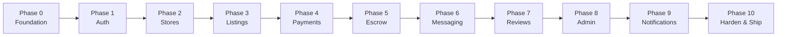

# U-Shop MVP Build Plan — Production-Grade, Feature by Feature

> **Methodology:** Vertical Slice Architecture — each feature is built end-to-end (Schema → API → Frontend → Tests) before moving to the next. This ensures a shippable product at every milestone.

> **Timeline:** 12 weeks (as per PRD v2.0)

---

## Build Order Strategy



> [!IMPORTANT]
> Each phase builds on the previous. Do NOT skip ahead. A broken foundation will haunt every feature built on top of it.

---

## Current Progress Snapshot

| Phase | Status | Notes |
|-------|--------|-------|
| Phase 0 — Foundation | ✅ Done | Monorepo, Prisma, Supabase, CI |
| Phase 1 — Auth | ✅ Done | Register, Login, Verify, Callback, Security middleware |
| Phase 0.5 — Component Library | ✅ Done | 15 components (Button, Badge, Input, Card, ProductCard, Modal, Header, Footer, etc.) |
| Phase 0.5 — DB Expansion | ✅ Done | University, Cart, Wishlist, Address tables + 5 university seeds |
| Phase 2 — Stores | 🔲 Next | Store creation, policies, public storefront |
| Phases 3–10 | 🔲 Planned | See below |

---

## Complete Page Inventory: Start → Production

This is the definitive list of every page in the application, organized by build phase. Each page lists its route, the components it uses, the API endpoints it calls, and which design reference to follow.

### Legend
- 🟢 = Built and shipped
- 🟡 = Needs update (exists but incomplete)
- 🔲 = Not started

---

## 🟢 BUILT — Phase 0: Foundation Pages

### Page 1: Root Layout (`app/layout.tsx`)
| Detail | Value |
|--------|-------|
| Route | Global wrapper |
| Status | 🟢 Done |
| Design Ref | `design/ui-kit/organisms/header.png`, `footer.png` |
| Components | `<Header />`, `<Footer />` (not yet wired) |
| Key Notes | Google Fonts (Plus Jakarta Sans, IBM Plex Mono), Material Symbols, globals.css |

**TODO on this page:**
- [ ] Wire `<Header />` and `<Footer />` components into the root layout
- [ ] Add conditional auth state (logged in / guest) to Header
- [ ] Add cart count and wishlist count to Header

---

## 🟢 BUILT — Phase 1: Authentication Pages

### Page 2: Login (`app/(auth)/login/page.tsx`)
| Detail | Value |
|--------|-------|
| Route | `/login` |
| Status | 🟢 Done |
| Design Ref | `design/ui-kit/Screens/desktop/Login screen.png` |
| Components | Custom form (not using shared Input yet) |
| API | Supabase `signInWithPassword()`, Supabase `signInWithOAuth()` |
| Backend | `POST /api/v1/auth/sync` (on successful login) |

**TODO on this page:**
- [ ] Refactor to use shared `<Input />`, `<Button />` components
- [ ] Add Google OAuth button

### Page 3: Register (`app/(auth)/register/page.tsx`)
| Detail | Value |
|--------|-------|
| Route | `/register` |
| Status | 🟢 Done |
| Design Ref | `design/ui-kit/Screens/desktop/Signup screen.png` |
| Components | Custom form with student verification toggle |
| API | Supabase `signUp()` with `wants_student_verification` metadata |

**TODO on this page:**
- [ ] Refactor to use shared `<Input />`, `<Button />`, `<Toggle />` components

### Page 4: Forgot Password (`app/(auth)/forgot-password/page.tsx`)
| Detail | Value |
|--------|-------|
| Route | `/forgot-password` |
| Status | 🟢 Done |
| Design Ref | `design/ui-kit/Screens/desktop/Forgot Password screen.png` |
| API | Supabase `resetPasswordForEmail()` |

### Page 5: Reset Password (`app/(auth)/reset-password/page.tsx`)
| Detail | Value |
|--------|-------|
| Route | `/reset-password` |
| Status | 🟢 Done |
| Design Ref | `design/ui-kit/Screens/desktop/Reset password screen.png` |
| API | Supabase `updateUser({ password })` |

### Page 6: Student Verification (`app/(auth)/verify/page.tsx`)
| Detail | Value |
|--------|-------|
| Route | `/verify?type=student` |
| Status | 🟢 Done |
| Design Ref | `design/ui-kit/Screens/desktop/Student Verification screen.png` |
| API | `POST /api/v1/auth/verify-student` |
| Key Notes | ID photo upload to Supabase Storage, university selector |

**TODO on this page:**
- [ ] Replace hardcoded university list with API call to `GET /api/v1/universities`

### Page 7: Auth Callback (`app/(auth)/callback/route.ts`)
| Detail | Value |
|--------|-------|
| Route | `/callback` |
| Status | 🟢 Done |
| Key Notes | Exchanges code for session, checks `wants_student_verification` metadata, redirects to `/verify?type=student` or `/` |

### Page 8: Dashboard (`app/dashboard/page.tsx`)
| Detail | Value |
|--------|-------|
| Route | `/dashboard` |
| Status | 🟡 Exists (placeholder) |
| Components | Dashboard layout with sidebar |

**TODO on this page:**
- [ ] Add user profile card
- [ ] Add quick-stats: recent orders, wallet balance, verification status
- [ ] Link to: orders, messages, wallet, store settings

---

## 🔲 Phase 2: Store Pages

### Page 9: Become a Seller (`app/dashboard/store/create/page.tsx`) — NEW
| Detail | Value |
|--------|-------|
| Route | `/dashboard/store/create` |
| Status | 🔲 Not started |
| Components | `<Input />`, `<Button />`, `<Textarea />`, `<Select />`, `<Card />` |
| API | `POST /api/v1/stores`, `GET /api/v1/stores/check-handle/:handle` |

**Build steps:**
1. Multi-step form: Store Name → Handle (live availability check) → Logo/Banner upload → Category selection
2. Handle debounced availability check (300ms) with visual feedback
3. Logo + Banner upload to Supabase Storage with progress bars
4. Preview of how the store URL will look
5. Submit creates store + updates user role to BOTH

### Page 10: Store Settings (`app/dashboard/store/settings/page.tsx`) — NEW
| Detail | Value |
|--------|-------|
| Route | `/dashboard/store/settings` |
| Status | 🔲 Not started |
| Components | `<Input />`, `<Textarea />`, `<Button />`, `<Select />`, `<Toggle />`, `<ConfirmModal />` |
| API | `PATCH /api/v1/stores/:id` |

**Build steps:**
1. Edit store name, bio (280 char counter), logo, banner
2. Return policy builder (dropdowns for return window, condition, refund method)
3. Warranty builder
4. Handle change — one-time, with confirmation modal warning
5. Policy preview rendered as plain-language text

### Page 11: Public Store Page (`app/store/[handle]/page.tsx`) — NEW
| Detail | Value |
|--------|-------|
| Route | `/store/:handle` |
| Status | 🔲 Not started |
| Components | `<ProductCard />`, `<Badge />`, `<EmptyState />` |
| API | `GET /api/v1/stores/:handle` |
| SEO | `generateMetadata()` — store name, description, OG image |

**Build steps:**
1. Server-rendered store header: logo, banner, name, bio, verified badge, rating
2. Listings grid using `<ProductCard />` (populated in Phase 3)
3. Return policy accordion
4. Share button (copy URL)
5. Empty state if no listings: "This store hasn't listed any items yet"

### Page 12: OG Image for Store (`app/api/og/store/route.ts`) — NEW
| Detail | Value |
|--------|-------|
| Route | `/api/og/store?handle=...` |
| Status | 🔲 Not started |
| Key Notes | Dynamic OG image with store name + logo. For WhatsApp/Twitter previews. |

---

## 🔲 Phase 3: Product Listing & Discovery Pages

### Page 13: Homepage (`app/page.tsx`) — REBUILD
| Detail | Value |
|--------|-------|
| Route | `/` |
| Status | 🟡 Placeholder exists |
| Design Ref | `design/web-designs/desktop/Homepage.html`, `design/ui-kit/Screens/desktop/Homepage.png` |
| Components | `<Header />`, `<Footer />`, `<ProductCard />`, `<SearchBar />`, `<Badge />`, `<Button />` |
| API | `GET /api/v1/listings?featured=true`, `GET /api/v1/categories`, `GET /api/v1/universities`, `GET /api/v1/stores?featured=true` |

**Sections to build (from Homepage.html design):**
1. **Escrow trust banner** — "Every purchase protected by escrow" (dismissible)
2. **Hero section** — Gradient purple bg, "Power Your Academic Excellence," Shop Deals + Sell Now CTAs
3. **Features bar** — 4 columns: Secure Payment, Verified Sellers, Campus Delivery, Local Support
4. **Browse Categories** — 4-column image grid (Laptops, Phones, Accessories, Tablets) with item counts
5. **Browse Universities** — 4-column card grid (UG, KNUST, UCC, UMAT, GCTU) with product counts
6. **Browse Stores** — 4-column store cards (logo, name, rating, university badge, "Visit Store" button)
7. **Featured Deals** — 4-column ProductCard grid with HOT/NEW/OFFER badges
8. **Student Deals** — Purple bg section with 3 promo cards (gradient bg, icon, CTA)
9. **Trending Now** — 4-column ProductCard grid

### Page 14: Search Results (`app/search/page.tsx`) — NEW
| Detail | Value |
|--------|-------|
| Route | `/search?q=...&category=...&condition=...&minPrice=...&maxPrice=...&sort=...` |
| Status | 🔲 Not started |
| Components | `<ProductCard />`, `<Input />`, `<Select />`, `<Badge />`, `<EmptyState />` |
| API | `GET /api/v1/listings?q=...` |

**Build steps:**
1. Filter sidebar: Category checkboxes, Condition checkboxes, Price range (min/max), University, Sort dropdown
2. Results grid: `<ProductCard />` in 4-col / 2-col / 1-col responsive grid
3. Pagination: cursor-based, infinite scroll or "Load More"
4. Result count: "Showing 1-20 of 142 results for 'MacBook Pro'"
5. Empty state: "No results found" with suggestions

### Page 15: Category Browsing (`app/categories/page.tsx`) — NEW
| Detail | Value |
|--------|-------|
| Route | `/categories` |
| Status | 🔲 Not started |
| Components | `<Card />` |
| API | `GET /api/v1/categories` |

**Build steps:**
1. Grid of category cards (image, name, item count)
2. Click navigates to `/search?category=laptops`

### Page 16: Single Category (`app/categories/[slug]/page.tsx`) — NEW
| Detail | Value |
|--------|-------|
| Route | `/categories/:slug` |
| Status | 🔲 Not started |
| Components | `<ProductCard />`, `<Badge />` |
| API | `GET /api/v1/listings?category=:slug` |
| SEO | `generateMetadata()` |

### Page 17: University Store Directory (`app/universities/page.tsx`) — NEW
| Detail | Value |
|--------|-------|
| Route | `/universities` |
| Status | 🔲 Not started |
| Components | `<Card />`, `<Badge />` |
| API | `GET /api/v1/universities` |

**Build steps:**
1. Grid of university cards with logo, name, short name, product count
2. Click navigates to `/universities/:slug`

### Page 18: Single University (`app/universities/[slug]/page.tsx`) — NEW
| Detail | Value |
|--------|-------|
| Route | `/universities/:slug` |
| Status | 🔲 Not started |
| Components | `<ProductCard />`, `<Card />` |
| API | `GET /api/v1/universities/:slug`, `GET /api/v1/listings?university=:slug` |
| SEO | `generateMetadata()` — university name, logo |

### Page 19: All Stores (`app/stores/page.tsx`) — NEW
| Detail | Value |
|--------|-------|
| Route | `/stores` |
| Status | 🔲 Not started |
| Components | `<Card />`, `<Badge />`, `<SearchBar />` |
| API | `GET /api/v1/stores` |

### Page 20: Create Listing (`app/dashboard/store/listings/new/page.tsx`) — NEW
| Detail | Value |
|--------|-------|
| Route | `/dashboard/store/listings/new` |
| Status | 🔲 Not started |
| Components | `<Input />`, `<Textarea />`, `<Select />`, `<Button />`, `<Badge />`, `<Toggle />` |
| API | `POST /api/v1/listings`, `GET /api/v1/categories` |

**Build steps:**
1. Multi-step form: Title → Category → Condition (criteria checklist) → Photos (drag-and-drop, min 3, max 6) → Price (GH₵) → Description → Policy preview → Publish or Save Draft
2. Photo upload with reorder, progress bars
3. Condition picker with detailed criteria for each grade
4. Price input with GH₵ prefix (never use float — Decimal)

### Page 21: Manage Listings (`app/dashboard/store/listings/page.tsx`) — NEW
| Detail | Value |
|--------|-------|
| Route | `/dashboard/store/listings` |
| Status | 🔲 Not started |
| Components | `<Card />`, `<Badge />`, `<Button />`, `<ConfirmModal />` |
| API | `GET /api/v1/listings?storeId=mine`, `PATCH /api/v1/listings/:id/status` |

**Build steps:**
1. Grid/list toggle view
2. Filter by status: All / Active / Draft / Paused / Sold
3. Bulk actions: Pause, Activate, Delete
4. Quick stats per listing: views, orders

### Page 22: Listing Detail (`app/listing/[id]/page.tsx`) — NEW
| Detail | Value |
|--------|-------|
| Route | `/listing/:id` |
| Status | 🔲 Not started |
| Components | `<Badge />`, `<Button />`, `<Card />`, `<ProductCard />` (related items) |
| API | `GET /api/v1/listings/:id` |
| SEO | `generateMetadata()` — product title, price, image |

**Build steps:**
1. Image gallery with lightbox + zoom
2. Product info: title, price, condition badge with explanation tooltip, stock status
3. Seller info card: store name, verified badge, rating, "Visit Store" link
4. Return policy accordion
5. "Buy Now" + "Add to Cart" + "Message Seller" buttons
6. Related products row (same category or store)

### Page 23: Student Deals (`app/student-deals/page.tsx`) — NEW
| Detail | Value |
|--------|-------|
| Route | `/student-deals` |
| Status | 🔲 Not started |
| Components | `<ProductCard />`, `<Badge />` |
| API | `GET /api/v1/listings?studentDeals=true` |

---

## 🔲 Phase 4: Checkout & Payment Pages

### Page 24: Cart (`app/cart/page.tsx`) — NEW
| Detail | Value |
|--------|-------|
| Route | `/cart` |
| Status | 🔲 Not started |
| Components | `<Button />`, `<Input />`, `<EmptyState />`, `<ConfirmModal />` |
| API | `GET /api/v1/cart`, `PATCH /api/v1/cart/items/:id`, `DELETE /api/v1/cart/items/:id` |

**Build steps:**
1. Cart items list: product image, title, vendor, price, quantity +/- controls, remove
2. Order summary sidebar: subtotal, shipping, tax, total
3. Promo code input
4. "Proceed to Checkout" button (requires auth)
5. Empty state: "Your cart is empty" + "Start Shopping" CTA
6. Guest cart → merge on login

### Page 25: Wishlist (`app/wishlist/page.tsx`) — NEW
| Detail | Value |
|--------|-------|
| Route | `/wishlist` |
| Status | 🔲 Not started |
| Components | `<ProductCard />`, `<EmptyState />`, `<Button />` |
| API | `GET /api/v1/wishlist`, `DELETE /api/v1/wishlist/items/:id` |

**Build steps:**
1. Grid of wishlisted products using `<ProductCard />`
2. "Move to Cart" action per item
3. Empty state: "Your wishlist is empty" with "Explore Products" CTA

### Page 26: Checkout — Delivery (`app/checkout/page.tsx`) — NEW
| Detail | Value |
|--------|-------|
| Route | `/checkout` |
| Status | 🔲 Not started |
| Design Ref | `design/ui-kit/organisms/Checkout flow.png` (Step 1) |
| Components | `<Input />`, `<Select />`, `<Button />`, `<Card />`, `<Toggle />` |
| API | `GET /api/v1/addresses`, `POST /api/v1/addresses` |

**Build steps (from Checkout flow.png — Step 1: Delivery):**
1. Progress stepper: ① Delivery → ② Payment → ③ Review
2. Shipping address selector (saved addresses with radio buttons)
3. "+ Add New Address" form (fullName, phone, line1, line2, city, region, digitalAddress, university, hall)
4. Delivery method selector: Campus Meetup (FREE), Standard Courier (GH₵ 25)
5. Student deal applied notice (if student verified)
6. Order Summary sidebar: item thumbnails, subtotal, shipping, tax, total
7. "Continue to Payment" button

### Page 27: Checkout — Payment (`app/checkout/payment/page.tsx`) — NEW
| Detail | Value |
|--------|-------|
| Route | `/checkout/payment` |
| Status | 🔲 Not started |
| Design Ref | `design/ui-kit/organisms/Checkout flow.png` (Step 2) |
| Components | `<Button />`, `<Card />`, `<Badge />` |
| API | `POST /api/v1/orders` → Paystack `authorization_url` |

**Build steps (from Checkout flow.png — Step 2: Payment):**
1. Payment method selector: Mobile Money (MTN, Telecel, AirtelTigo) / Card
2. Phone number input (for MoMo)
3. Secure Student Escrow Protection info section (3-step: Pay → Deliver → Release)
4. Protection notice: "Open a dispute within 48h to freeze funds"
5. Order summary sidebar (same as delivery step)
6. "Continue to Review" button

### Page 28: Checkout — Review (`app/checkout/review/page.tsx`) — NEW
| Detail | Value |
|--------|-------|
| Route | `/checkout/review` |
| Status | 🔲 Not started |
| Design Ref | `design/ui-kit/organisms/Checkout flow.png` (Step 3) |
| Components | `<Button />`, `<Card />`, `<Input />`, `<Badge />` |

**Build steps (from Checkout flow.png — Step 3: Review):**
1. Review Your Order: Delivery address (with Change link), Payment method (with Change link), Order items
2. Order Summary: items, shipping, student discount, tax, total amount (GH₵)
3. Trust badges: "Secure encrypted checkout", "Escrow protected"
4. Promo code input + Apply button
5. Escrow timeline: "You pay → Seller delivers → You confirm → Seller gets paid"
6. "Place Order (GH₵ X,XXX)" button
7. "Back to Payment" link

### Page 29: Payment Success (`app/checkout/success/page.tsx`) — NEW
| Detail | Value |
|--------|-------|
| Route | `/checkout/success?ref=...` |
| Status | 🔲 Not started |
| Design Ref | `design/ui-kit/organisms/Checkout flow.png` (bottom section) |
| Components | `<Button />`, `<Card />` |

**Build steps (from Checkout flow.png — success screen):**
1. Green check icon + "Payment Received. GH₵ X,XXX held safely in escrow."
2. Order confirmation text
3. Order reference (e.g. `ORD-3924-001234`) with copy button
4. Escrow Protection Active notice: "Funds released after 7 days if no dispute"
5. "View Order Details" (primary) + "Continue Shopping" (outline) buttons
6. "Need help?" link to support

### Page 30: Payment Cancelled (`app/checkout/cancelled/page.tsx`) — NEW
| Detail | Value |
|--------|-------|
| Route | `/checkout/cancelled` |
| Status | 🔲 Not started |
| Components | `<EmptyState />`, `<Button />` |

---

## 🔲 Phase 5: Order & Wallet Pages

### Page 31: Buyer Order History (`app/dashboard/orders/page.tsx`) — NEW
| Detail | Value |
|--------|-------|
| Route | `/dashboard/orders` |
| Status | 🔲 Not started |
| Components | `<Card />`, `<Badge />`, `<EmptyState />` |
| API | `GET /api/v1/orders` |

**Build steps:**
1. Order list with status filter tabs: All / Active / Completed / Disputed
2. Each order card: order ID, date, items summary, total, status badge, "View" button
3. Empty state: "No orders yet" + "Start Shopping" CTA

### Page 32: Order Detail (`app/dashboard/orders/[id]/page.tsx`) — NEW
| Detail | Value |
|--------|-------|
| Route | `/dashboard/orders/:id` |
| Status | 🔲 Not started |
| Components | `<Card />`, `<Badge />`, `<Button />`, `<ConfirmModal />` |
| API | `GET /api/v1/orders/:id`, `PATCH /api/v1/orders/:id/confirm-delivery` |

**Build steps:**
1. Order status timeline: Placed → Paid → Dispatched → Delivered → Completed
2. Item details: product images, names, quantities, prices
3. Delivery info: address, method, tracking (if available)
4. "Confirm Delivery" button (triggers escrow release countdown)
5. "Open Dispute" button (if within 48h window)
6. Escrow status section

### Page 33: Seller Transactions (`app/dashboard/store/transactions/page.tsx`) — NEW
| Detail | Value |
|--------|-------|
| Route | `/dashboard/store/transactions` |
| Status | 🔲 Not started |
| Components | `<Card />`, `<Badge />`, `<Button />` |
| API | `GET /api/v1/orders?seller=me` |

**Build steps:**
1. Incoming orders list with status filters
2. Per-order actions: "Mark as Dispatched", "Enter Tracking Number", "Generate Meetup Code"
3. Order timeline view
4. Revenue summary: total earned, pending escrow, available balance

### Page 34: Wallet (`app/dashboard/wallet/page.tsx`) — NEW
| Detail | Value |
|--------|-------|
| Route | `/dashboard/wallet` |
| Status | 🔲 Not started |
| Components | `<Card />`, `<Button />`, `<Input />`, `<Select />`, `<Badge />` |
| API | `GET /api/v1/wallet`, `GET /api/v1/wallet/transactions`, `POST /api/v1/wallet/payout` |

**Build steps:**
1. Balance card: available balance (GH₵), pending escrow, total earned
2. Transaction history table: date, type, description, amount, status
3. Payout request form: choose MoMo or Bank, enter details, minimum GH₵ 20
4. Payout history with status badges

---

## 🔲 Phase 6: Messaging Pages

### Page 35: Message Inbox (`app/dashboard/messages/page.tsx`) — NEW
| Detail | Value |
|--------|-------|
| Route | `/dashboard/messages` |
| Status | 🔲 Not started |
| Components | `<Card />`, `<Badge />`, `<EmptyState />` |
| API | `GET /api/v1/messages/threads` |

**Build steps:**
1. Thread list: avatar, store/user name, last message preview, timestamp, unread dot
2. Empty state: "No messages yet"

### Page 36: Message Thread (`app/dashboard/messages/[threadId]/page.tsx`) — NEW
| Detail | Value |
|--------|-------|
| Route | `/dashboard/messages/:threadId` |
| Status | 🔲 Not started |
| Components | `<Input />`, `<Button />`, `<Card />`, `<Badge />` |
| API | `GET /api/v1/messages/threads/:id`, `POST /api/v1/messages`, `PATCH /api/v1/messages/:id/read` |

**Build steps:**
1. Chat UI: message bubbles (sender/receiver), timestamps
2. Input field with send button
3. Listing/Order context card at top of thread
4. Content filter warnings (phone numbers, social handles blocked)

---

## 🔲 Phase 7: Reviews

### Page 37: Write Review (`app/dashboard/orders/[id]/review/page.tsx`) — NEW
| Detail | Value |
|--------|-------|
| Route | `/dashboard/orders/:id/review` |
| Status | 🔲 Not started |
| Components | `<Input />`, `<Textarea />`, `<Button />` |
| API | `POST /api/v1/reviews` |

**Build steps:**
1. Star rating input (1-5, click to select)
2. Review text (optional, max 500 chars)
3. "Verified Purchase" badge auto-applied
4. Submit sends review tied to order

---

## 🔲 Phase 8: Admin Pages

### Page 38: Admin Dashboard (`app/admin/page.tsx`) — NEW
| Detail | Value |
|--------|-------|
| Route | `/admin` |
| Status | 🔲 Not started |
| Components | `<Card />`, `<Badge />` |
| API | `GET /api/v1/admin/stats` |

**Build steps:**
1. Key metrics: total orders, GMV, active stores, active disputes, pending verifications
2. Quick links to queues

### Page 39: Admin — Verification Queue (`app/admin/verification/page.tsx`) — NEW
| Detail | Value |
|--------|-------|
| Route | `/admin/verification` |
| Status | 🔲 Not started |
| API | `GET /api/v1/admin/verifications?status=PENDING`, `PATCH /api/v1/admin/verifications/:id` |

**Build steps:**
1. Pending verification list
2. Per-item: student ID photo, user profile, university, approve/reject with reason

### Page 40: Admin — Disputes (`app/admin/disputes/page.tsx`) — NEW
| Detail | Value |
|--------|-------|
| Route | `/admin/disputes` |
| Status | 🔲 Not started |
| API | `GET /api/v1/admin/disputes` |

**Build steps:**
1. Dispute list with priority sorting
2. Detail view: evidence, policy snapshot, message history, resolve with reason

### Page 41: Admin — Users (`app/admin/users/page.tsx`) — NEW
| Detail | Value |
|--------|-------|
| Route | `/admin/users` |
| Status | 🔲 Not started |
| API | `GET /api/v1/admin/users` |

### Page 42: Admin — Listing Moderation (`app/admin/listings/page.tsx`) — NEW
| Detail | Value |
|--------|-------|
| Route | `/admin/listings` |
| Status | 🔲 Not started |
| API | `GET /api/v1/admin/listings?flagged=true` |

---

## 🔲 Phase 9: Static / Info Pages

### Page 43: About Us (`app/about/page.tsx`) — NEW
| Route | `/about` |

### Page 44: Contact Us (`app/contact/page.tsx`) — NEW
| Route | `/contact` |

### Page 45: Help Center / FAQ (`app/help/page.tsx`) — NEW
| Route | `/help` |

### Page 46: Privacy Policy (`app/privacy/page.tsx`) — NEW
| Route | `/privacy` |

### Page 47: Terms of Service (`app/terms/page.tsx`) — NEW
| Route | `/terms` |

### Page 48: Cookie Policy (`app/cookies/page.tsx`) — NEW
| Route | `/cookies` |

### Page 49: Returns & Refunds (`app/returns/page.tsx`) — NEW
| Route | `/returns` |

### Page 50: Track Order (`app/track/page.tsx`) — NEW
| Route | `/track` |

### Page 51: Sell on U-Shop (`app/sell/page.tsx`) — NEW
| Route | `/sell` |

---

## 🔲 Phase 10: Error & System Pages

### Page 52: 404 Not Found (`app/not-found.tsx`)
| Route | Any unmatched route |
| Status | 🟡 Default exists |
| Components | `<EmptyState />`, `<Button />` |

**TODO:**
- [ ] Custom branded 404 with "Back to Home" CTA

### Page 53: Error Boundary (`app/error.tsx`)
| Route | Runtime errors |
| Status | 🔲 Not started |
| Components | `<EmptyState />`, `<Button />` |

### Page 54: Loading (`app/loading.tsx`)
| Route | Global loading state |
| Status | 🔲 Not started |

---

## Summary: All 54 Pages by Phase

| Phase | Pages | Count | Status |
|-------|-------|-------|--------|
| Foundation | Root Layout | 1 | 🟡 Needs Header/Footer |
| Auth | Login, Register, Forgot Password, Reset Password, Verify, Callback, Dashboard | 7 | 🟢 Done (refactor pending) |
| Stores | Create Store, Store Settings, Public Store, OG Image | 4 | 🔲 |
| Listings & Discovery | Homepage, Search, Categories (2), Universities (2), Stores, Create Listing, Manage Listings, Listing Detail, Student Deals | 11 | 🟡 Homepage placeholder |
| Checkout & Payments | Cart, Wishlist, Checkout (3 steps), Success, Cancelled | 7 | 🔲 |
| Orders & Wallet | Buyer Orders (2), Seller Transactions, Wallet | 4 | 🔲 |
| Messaging | Inbox, Thread | 2 | 🔲 |
| Reviews | Write Review | 1 | 🔲 |
| Admin | Dashboard, Verification, Disputes, Users, Listings | 5 | 🔲 |
| Static / Info | About, Contact, Help, Privacy, Terms, Cookies, Returns, Track, Sell | 9 | 🔲 |
| System | 404, Error, Loading | 3 | 🟡 Default 404 |
| **Total** | | **54** | **8 done, 46 remaining** |

---

## Build Execution Order (Recommended)

```
Week 3:   Homepage rebuild + Store pages (Pages 9-13)
Week 4:   Category + University + Store browsing (Pages 14-19)
Week 5:   Create/Manage Listings + Listing Detail (Pages 20-23)
Week 6:   Cart + Wishlist + Checkout flow (Pages 24-30)
Week 7:   Order pages + Wallet (Pages 31-34)
Week 8:   Messaging (Pages 35-36) + Reviews (Page 37)
Week 9:   Admin panel (Pages 38-42)
Week 10:  Static pages (Pages 43-51) + System pages (Pages 52-54)
Week 11:  Component refactoring, UX polish, responsive testing
Week 12:  Security hardening, deployment, final QA
```

---

## Phase-Specific Backend Work: Quick Reference

Each frontend phase requires backend API endpoints. Here's the API work that must be done *before* or *alongside* each set of pages:

| Phase | Backend Work Required |
|-------|----------------------|
| Phase 2 (Stores) | Store CRUD routes, handle availability API, store service |
| Phase 3 (Listings) | Listing CRUD routes, search service, full-text search setup, category seeding, university API |
| Phase 4 (Payments) | Cart CRUD routes, wishlist CRUD routes, order service, Paystack integration, webhook handler, address CRUD |
| Phase 5 (Escrow) | Escrow service, wallet service, auto-release cron, reminder scheduler |
| Phase 6 (Messaging) | Message routes, content filtering, unread count endpoint |
| Phase 7 (Reviews) | Review CRUD routes, rating aggregation |
| Phase 8 (Admin) | Admin routes (protected), verification queue, dispute resolution, user management |
| Phase 9 (Notifications) | Resend email integration, notification service, in-app notification model |

---

## Pre-Flight Checklist Per Page

Before building any page, verify:

- [ ] API endpoint exists (or build it first)
- [ ] Prisma schema supports the data needed
- [ ] Design reference exists (PNG, HTML, or Figma)
- [ ] Components needed are available in `@/components`
- [ ] Zod validation schema exists for any form inputs
- [ ] Error states are defined (what happens on API failure?)
- [ ] Empty states are defined (what if there's no data?)
- [ ] Loading states are defined (skeleton, not spinner)
- [ ] Mobile responsive layout is planned (test at 375px, 768px, 1440px)
- [ ] SEO metadata is configured via `generateMetadata()`
