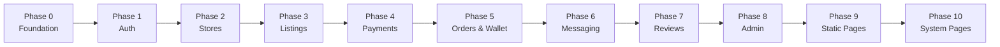

# U-Shop MVP Build Plan — Production-Grade, Feature by Feature

> **Methodology:** Vertical Slice Architecture — each feature is built end-to-end (Schema → API → Frontend → Tests) before moving to the next. This ensures a shippable product at every milestone.

> **Timeline:** 12 weeks (as per PRD v2.0)

---

## Build Order Strategy

> [!IMPORTANT]
> Each phase builds on the previous. Do NOT skip ahead. A broken foundation will haunt every feature built on top of it.

---

## 🟢 Phase 0: Foundation
### What & Why
Setting up the core project architecture. Why? A solid foundation ensures zero technical debt and seamless scaling as the app grows.

### Backend Tasks
- **Monorepo Setup:** Configure Turborepo, Next.js, and Express.js workspaces.
- **Database Architecture:** Configure Prisma and Supabase PostgreSQL with `DATABASE_URL` (PgBouncer) and `DIRECT_URL`.
- **Infrastructure Setup:** Docker container configuration targeting Railway for Express and Vercel for Next.js.
- **Initial Schema Seeding:** Create base `User`, `Category`, and `University` tables and seed initial database states using `prisma/seed.ts`.

### Frontend Tasks
- **Component Library Setup:** Configure Tailwind CSS, generic atomic UI components (Button, Badge, Input, Card).
- **Core Layout (`app/layout.tsx`):** Build the root layout, integrate global fonts, Header, and Footer placeholder components.
- **API Wrapper:** Implement `apiFetch` in Next.js to provide type-safe HTTP communication with the Express backend using active Supabase Sessions.

---

## 🟢 Phase 1: Authentication & User Verification
### What & Why
Handling user onboarding and student verification. Why? Building trust is central to U-Shop. We must guarantee user identity and verification before any marketplace activity begins.

### Backend Tasks
- **Auth API Configuration:** Integrate Supabase Auth service (via backend admin client).
- **Sync Endpoints:** Build `POST /api/v1/auth/sync` to persist users from Supabase to Prisma.
- **Verification Logic:** Build `POST /api/v1/auth/verify-student` covering automated `.edu.gh` domain matching and manual student ID upload to Supabase Storage. Includes creating the `StorageService` utility.

### Frontend Tasks
- **Login Page (`app/(auth)/login/page.tsx`):** Email + Password and OAuth login interface.
- **Register Page (`app/(auth)/register/page.tsx`):** Signup form with Student Verification toggle.
- **Forgot/Reset Password (`app/(auth)/forgot-password/page.tsx` & `reset-password/page.tsx`)**
- **Student Verification Page (`app/(auth)/verify/page.tsx`):** University select dynamic dropdown linked to API and ID upload flow.
- **Callback Route (`app/(auth)/callback/route.ts`):** Exchange authorization code, evaluates `wants_student_verification` metadata, and implements conditional redirects.
- **Dashboard Placeholder (`app/dashboard/page.tsx`):** Baseline entry point post-login handling protected routes.

---

## 🔲 Phase 2: Stores
### What & Why
Allowing verified users to become sellers. Why? Marketplace supply relies on sellers. They need tools to manage their store branding, storefront URLs, and policies.

### Backend Tasks
- **Store Schema & Methods:** Refine Prisma models for `Store` handling URLs and policies.
- **Store APIs:**
  - `POST /api/v1/stores`: Initialize a new store tied to an existing user payload.
  - `PATCH /api/v1/stores/:id`: Expose methods for updating bio, policies, and branding.
  - `GET /api/v1/stores/check-handle/:handle`: Live username availability check algorithm ensuring unique handles.
  - `GET /api/v1/stores/:handle`: Fetch public, safe store data omitting internal statistics for the frontend viewer.

### Frontend Tasks
- **Become a Seller (`app/dashboard/store/create/page.tsx`):** Multi-step onboarding form involving Handle validation debounce checks and image uploads using progress bars.
- **Store Settings (`app/dashboard/store/settings/page.tsx`):** Settings form updating return windows, conditions, and bio with character limits.
- **Public Store Page (`app/store/[handle]/page.tsx`):** Server-rendered storefront with verified badges, store ratings, policy accordions, and populated active listings grid.
- **OG Image Generator (`app/api/og/store/route.ts`):** Next.js Image Edge generator dynamically creating branded social-sharing images using the Store logo and Handle.

---

## 🔲 Phase 3: Product Listing & Discovery
### What & Why
Creating and discovering items. Why? Core marketplace functionality. Requires robust searching, categorization, and filtering to match students to the right tech deals effectively.

### Backend Tasks
- **Listing APIs:** CRUD endpoints (`GET`, `POST`, `PATCH`, `DELETE` mapped to `/api/v1/listings`).
- **Search Engine Logic:** Implement exact/partial searching using Prisma querying and full-text vectors.
- **Dynamic Retrieval APIs:** Construct `GET /api/v1/categories`, `GET /api/v1/universities`, and popular/trending aggregation data feeds.
- **Student Deals Algorithm:** Establish `studentDeals=true` filtering metric to surface highly-discounted relevant student gear.

### Frontend Tasks
- **Create Listing (`app/dashboard/store/listings/new/page.tsx`):** Multi-step publisher (uploading 3-6 photos, verifying category, defining pricing with exact conditions).
- **Manage Listings (`app/dashboard/store/listings/page.tsx`):** Inventory management UI capable of pausing, updating, and viewing quick stats of stock.
- **Homepage (`app/page.tsx`):** Rebuild the layout encompassing Hero Deal banners, 4-column item grids, verified store highlights, and active escrow guarantees.
- **Search Results (`app/search/page.tsx`):** Intense grid view reacting to sidebar filters (Category checkboxes, University params, Price slider). Integrates cursor-based infinite scroll/pagination.
- **Category Browsing (`app/categories/page.tsx` & `[slug]/page.tsx`):** Curated grids filtered strictly by technical hardware type.
- **University Directory (`app/universities/page.tsx` & `[slug]/page.tsx`):** Directory viewing hardware local to campuses.
- **All Stores (`app/stores/page.tsx`):** Top verified stores sorted by volume/reputation.
- **Listing Detail (`app/listing/[id]/page.tsx`):** Product focus hub. Contains image gallery lightbox, status badges, contextual seller data, and "Buy/Cart" trigger modules.
- **Student Deals (`app/student-deals/page.tsx`):** Prominent markdown aggregator page.

---

## 🔲 Phase 4: Checkout & Payments
### What & Why
The financial transaction pipeline. Why? Managing secure payments through local payment gateways (Paystack) ensures safety and generates the escrow flow. Handling money requires the most intense backend reliability.

### Backend Tasks
- **Cart API Layer:** Secure `GET`, `PATCH`, and `DELETE` sets mapping to user context for standard server-side carts.
- **Checkout Process APIs:**
  - Address verification/saving via `GET/POST /api/v1/addresses`.
  - Transaction initiation generating Paystack `authorization_url` via `POST /api/v1/orders`.
- **Paystack Webhooks:** Ultra-secure endpoint handling untampered generic body parsing to verify Paystack HMAC hashes, successfully flagging initial orders to move into Escrow.

### Frontend Tasks
- **Cart Page (`app/cart/page.tsx`):** Cart visualizer implementing qty updates, summary sliders, and guest-to-live merge hooks.
- **Wishlist Page (`app/wishlist/page.tsx`):** Secondary stash UI providing 1-click moves to Cart. 
- **Checkout — Delivery (`app/checkout/page.tsx`):** Multi-stage stepper starting with mapping Meetup vs Generic Courier selections to calculating final checkout fees.
- **Checkout — Payment (`app/checkout/payment/page.tsx`):** Mobile Money (MoMo) focused integration bridging to card options.
- **Checkout — Review (`app/checkout/review/page.tsx`):** Order summary with escrow protection confidence trackers before finalizing charge requests.
- **Payment Outcomes (`app/checkout/success/page.tsx`, `cancelled/page.tsx`):** Render references, copy-to-clipboard transaction hashes, and gracefully handling payment drops.

---

## 🔲 Phase 5: Orders & Wallet (Escrow & Payouts)
### What & Why
Managing active orders and cashing out. Why? The 3-way escrow process maintains trust. Users need robust interfaces to confirm deliveries, allowing automated cron jobs and payouts to clear funds seamlessly.

### Backend Tasks
- **Order State Machine API:** Complex logic guaranteeing linear progression: PENDING → PAID_HELD → SHIPPED_IN_TRANSIT → DELIVERED → FUNDS_RELEASED.
- **Escrow Cron Jobs:** Background BullMQ workers actively scanning the Prisma DB every 60s to automatically release funds 7 days post-delivery or enforce reminders.
- **Wallet APIs:** Establish ledger APIs via `GET /api/v1/wallet/transactions` and Payout hooks mapping user balances to Paystack bank transit protocols (`POST /api/v1/wallet/payout`).

### Frontend Tasks
- **Buyer Orders (`app/dashboard/orders/page.tsx` & `[id]/page.tsx`):** Timeline visualizer for delivery tracking, supplemented with the critical Action to manually "Confirm Delivery". 
- **Seller Transactions (`app/dashboard/store/transactions/page.tsx`):** Fulfiller's interface to input tracking numbers or trigger OTP generation for local meetup authorization.
- **Wallet Dashboard (`app/dashboard/wallet/page.tsx`):** Financial hub resolving active balance ledgers, plotting pending escrow graphs, and firing withdrawal forms (ensuring minimum requirements).

---

## 🔲 Phase 6: Messaging
### What & Why
Dispute prevention and negotiation. Why? Buyers ask questions. Keeping this communication on-platform generates an audit log for dispute resolution and helps restrict fee-avoidance measures.

### Backend Tasks
- **Messaging APIs:** Rapid polling endpoints for thread mapping: `GET /api/v1/messages/threads` & `POST /api/v1/messages`.
- **Content filtering algorithm:** Implementation of stripping filters ensuring WhatsApp numbers/social handles trigger warnings or redact, ensuring platform safety.

### Frontend Tasks
- **Message Inbox (`app/dashboard/messages/page.tsx`):** Sidebar navigation of active communication threads summarizing recent unread statuses.
- **Chat Thread UI (`app/dashboard/messages/[threadId]/page.tsx`):** Real-time-mimicking interface contextualized persistently around the active order/listing module at the header.

---

## 🔲 Phase 7: Reviews
### What & Why
Establishing transparent vendor reputation. Why? Trust forces velocity. Organic, purchase-backed reviews ensure high-quality sellers succeed.

### Backend Tasks
- **Review APIs:** Post-transaction logic generating `POST /api/v1/reviews` exclusively triggered by DELIVERED state machines. 
- **Aggregation Rules:** Ensure the Database processes the summation of new ratings, rewriting the `averageRating` safely inside a transaction isolated from frontend manipulation.

### Frontend Tasks
- **Write Review Flow (`app/dashboard/orders/[id]/review/page.tsx`):** Simple 1-5 star module with character-limited optional text generation, emphasizing the 'Verified Purchase' flag securely.

---

## 🔲 Phase 8: Admin & Moderation
### What & Why
Root-level control mechanisms. Why? Escalated disputes, fraudulent accounts, and uploaded student IDs require robust manual overrides. 

### Backend Tasks
- **Protected Admin Space (`/api/v1/admin/*`):** High privilege routes bounded by the `ADMIN` User Role check wrapping sensitive queries.
- **Verification Job Logic:** Actions accepting or cleanly rejecting Student IDs alongside generating specific rejection reason protocols.
- **Dispute Mediations Module:** Logic bypassing normal Escrow crons explicitly refunding to buyer sources or manually clearing to seller wallets via administrative intervention.

### Frontend Tasks
- **Admin Dashboard (`app/admin/page.tsx`):** Overview metrics (Total GMV, Escrow locked, Active tickets).
- **Verification Queue (`app/admin/verification/page.tsx`):** Rapid image reviewing interface for Student IDs.
- **Disputes Queue (`app/admin/disputes/page.tsx`):** Consolidating timeline data, chat logs, and shipping histories for quick administrative rulings.
- **Platform Moderation (`app/admin/users/page.tsx` & `admin/listings/page.tsx`):** Access to suspend accounts, ban listings, or reset false data points.

---

## 🔲 Phase 9: Static / Info Pages
### What & Why
Marketing collateral and legal necessities. Why? SEO mapping, user trust, and fulfilling local data protection requirements and establishing binding terms strings.

### Backend / Frontend Tasks
- *Generally pure Frontend React Routing.*
- **About Us (`app/about/page.tsx`)**
- **Contact Us (`app/contact/page.tsx`)**
- **Help Center (`app/help/page.tsx`)**
- **Privacy Policy (`app/privacy/page.tsx`)**
- **Terms of Service (`app/terms/page.tsx`)**
- **Cookie Policy (`app/cookies/page.tsx`)**
- **Returns & Refunds (`app/returns/page.tsx`)**
- **Track Order (`app/track/page.tsx`)**
- **Sell on U-Shop (`app/sell/page.tsx`)**

---

## 🔲 Phase 10: System Handling & Final Polish
### What & Why
Robust fallback scenarios. Why? Hardening the framework so backend timeouts or deleted routes deliver polished brand experiences rather than raw trace logs.

### Backend Tasks
- Final security configurations across environment variables, finalizing Sentry implementations.

### Frontend Tasks
- **404 Not Found (`app/not-found.tsx`):** Intervening matched routes with custom layouts offering return-home loops.
- **Error Boundary (`app/error.tsx`):** Enclosing catastrophic errors gracefully with 'Try Again' state resets.
- **Loading Implementations (`app/loading.tsx`):** Sweeping deployment of custom skeleton loaders replacing native block screens to maximize perceived loading capabilities.

---

## Summary: All 54 Pages by Phase

| Phase | Core Goal | Pages Total |
|-------|-----------|-------------|
| 0 | Foundation & Layouts | 1 |
| 1 | Auth & Onboarding | 7 |
| 2 | Stores & Branding | 4 |
| 3 | Listings & Discovery | 11 |
| 4 | Checkout & Escrow Initializing| 7 |
| 5 | Orders, Wallet & Payouts | 4 |
| 6 | Buyer-Seller Messaging | 2 |
| 7 | Reviews | 1 |
| 8 | Admin Board | 5 |
| 9 | Static Information | 9 |
| 10 | System States | 3 |
| **Total** | | **54 Pages** |

## Pre-Flight Checklist Per Page
Before touching code for any module, verify:
- [ ] Ensure related Prisma schema components support data specifications natively and generated correctly via explicit Prisma calls. 
- [ ] Draft internal backend API endpoints mapping fully typed Zod endpoints for rigorous body validation.
- [ ] Match Frontend generic UI components referencing atomic standards.
- [ ] Design handling architectures dealing intelligently with Backend 500s or native 404 Empty States.
- [ ] Map appropriate dynamic edge caching logic optimizing speed without affecting necessary data staleness.
